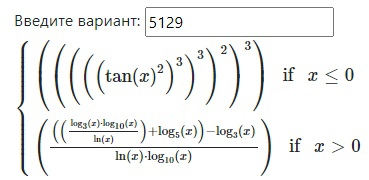
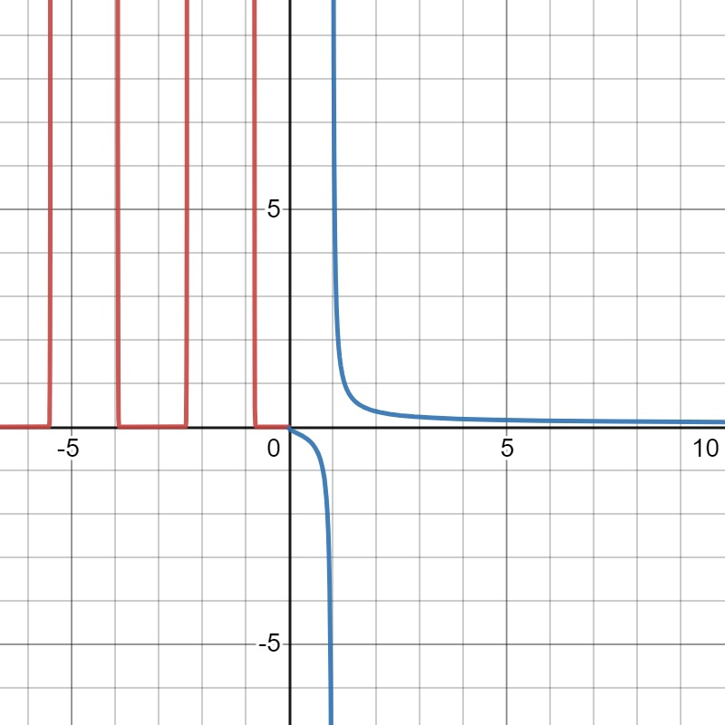

# Лабораторная №2 - по ТПО 
## Задание
Провести интеграционное тестирование программы, осуществляющей вычисление системы функций (в соответствии с вариантом).

### Вариант 5129:



```
x <= 0 : (((((tan(x) ^ 2) ^ 3) ^ 3) ^ 2) ^ 3)
x > 0 : (((((log_3(x) * log_10(x)) / ln(x)) + log_5(x)) - log_3(x)) / (ln(x) * log_10(x)))
```



### Правила выполнения работы:
1. Все составляющие систему функции (как тригонометрические, так и логарифмические) должны быть выражены через базовые (тригонометрическая зависит от варианта; логарифмическая - натуральный логарифм). 
2. Структура приложения, тестируемого в рамках лабораторной работы, должна выглядеть следующим образом (пример приведён для базовой тригонометрической функции sin(x)):  
3. 
4. Обе "базовые" функции (в примере выше - sin(x) и ln(x)) должны быть реализованы при помощи разложения в ряд с задаваемой погрешностью. Использовать тригонометрические / логарифмические преобразования для упрощения функций ЗАПРЕЩЕНО. 
5. Для КАЖДОГО модуля должны быть реализованы табличные заглушки. При этом, необходимо найти область допустимых значений функций, и, при необходимости, определить взаимозависимые точки в модулях. 
6. Разработанное приложение должно позволять выводить значения, выдаваемое любым модулем системы, в сsv файл вида «X, Результаты модуля (X)», позволяющее произвольно менять шаг наращивания Х. Разделитель в файле csv можно использовать произвольный.

## Расположение файлов
+ [Main](./src/main/java/com/krivonosovandmarkov) `<- Классы с логикой для каждого задания`
+ [Tests](./src/test/java/com/krivonosovandmarkov) `<- Классы для тестирования`

## Полезная информация
+ [JUnit 5](https://www.baeldung.com/parameterized-tests-junit-5)
+ [График системы](https://www.desmos.com/calculator/pa0j2wg3wb)
+ [Mockito - annotations](https://www.baeldung.com/mockito-annotations)
+ [Mockito - использование](https://java-online.ru/junit-mockito.xhtml)
+ [BigDecimal / BigInteger](https://metanit.com/java/tutorial/12.2.php)
+ [WolframAlpha](https://www.wolframalpha.com/)

## Шаблон тестирующего метода
```
@Test
@DisplayName("Test name")
void testName() {
    assertAll(
        () -> assertEquals(1, 1)
    );
}
```

```
@ParameterizedTest
@DisplayName("Parameterized test name")
@ValueSource(its = {1})
void parameterizedTestName(int param) {
    assertAll(
        () -> assertEquals(1, param)
    );
}
```